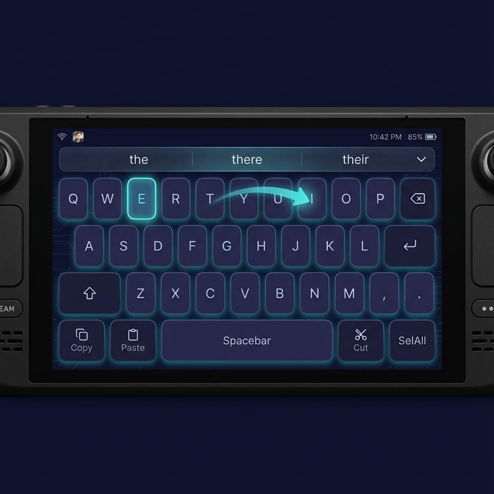

# Keyboard UI / QML Layout Agent

**Design Document for Magic Keyboard On-Screen UI**

Optimized for Apple Magic Trackpad pointer input on Steam Deck Desktop Mode.

---

## Executive Summary

This document defines the UI/UX philosophy, key geometry model, and interaction rules for the Magic Keyboard on-screen interface. The design prioritizes **pointer accuracy over key density**, recognizing that trackpad input differs fundamentally from touch.

### Steam Deck Display Context

| Property | Value |
|----------|-------|
| Resolution | 1280 × 800 px |
| Diagonal | 7" |
| PPI | ~215 |
| Available Height (docked KB) | ~500 px (after reserving ~300px for keyboard) |

---

## Visual Reference



*Pointer-optimized on-screen keyboard with generous key sizing, 8px gaps, hover feedback, and swipe trail visualization.*

---

## Key Deliverables

This document defines:

| Deliverable | Description | File |
|-------------|-------------|------|
| **Layout Philosophy** | Pointer-first design principles | This document §1 |
| **Key Geometry Model** | Grid units, sizes, hit zones | This document §2 |
| **Interaction Rules** | Hover, click, swipe behavior | This document §3 |
| **Visual Design** | Colors, typography, scaling | This document §4-5 |
| **QML Implementation** | Pointer-optimized keyboard | `src/ui/KeyboardWindowV2.qml` |
| **Layout JSON** | Enhanced geometry spec | `data/layouts/qwerty-pointer.json` |

---

## 1. Layout Philosophy

### Core Principle: Pointer > Touch

Touch keyboards optimize for finger pads (~10mm contact area). Trackpad pointers are **single-pixel precise**. This inversion changes everything:

| Aspect | Touch-First | Pointer-First (Us) |
|--------|-------------|-------------------|
| Key size | Minimum ~44px (Apple HIG) | Larger = faster acquisition |
| Gaps | Minimal (finger slides) | Important for visual clarity |
| Hover | N/A | **Critical feedback path** |
| Click depth | Deep targets OK | Surface click = instant commit |
| Error model | Fat-finger, need correction | Mis-aim, need hover confirmation |

### Design Tenets

1. **No Tiny Keys** — Every key ≥ 56×48 px (minimum letter key). Special keys 1.5× or 2× base width.

2. **Generous Gaps** — 8px spacing between keys to prevent mis-clicks and provide clear visual separation.

3. **Click Target > Visual Size** — Invisible hit zones extend 4px beyond visual borders ("forgiving targets").

4. **Hover Feedback Instant** — < 16ms response. Hover state provides pre-click confirmation.

5. **Predictable Geometry** — Rows align to consistent grid. No floating keys.

6. **Swipe-Compatible Density** — Letter keys arranged so common letter transitions (per English bigram frequency) traverse smooth paths.

---

## 2. Key Geometry Model

### Base Unit System

```
┌────────────────────────────────────────────────────────────────────────┐
│  GRID UNIT (1u) = 64px                                                  │
│  All key sizes expressed as multiples of 1u                             │
│                                                                         │
│  Standard letter key:  1u × 0.8u  = 64 × 52 px (visual)                 │
│                        hit zone   = 72 × 60 px (+4px each side)         │
│  Gap between keys:     8px                                              │
│  Row height:           60px (52px key + 8px gap)                        │
└────────────────────────────────────────────────────────────────────────┘
```

### Steam Deck Scaling

```javascript
// Dynamic sizing based on screen width
const SCREEN_WIDTH = 1280;  // Steam Deck native
const TARGET_KB_WIDTH = 1200;  // 94% screen width
const MARGIN = 40;  // 20px each side

const GRID_UNIT = Math.floor((TARGET_KB_WIDTH - MARGIN) / 12);  // ~96px
// Scale down for dense layouts
const UNIT = 64;  // Fixed for consistency, allows 13+ units per row
```

### Key Size Classes

| Size Class | Grid Units | Visual (px) | Hit Zone (px) | Use Cases |
|------------|-----------|-------------|---------------|-----------|
| **1u** | 1.0 | 64 × 52 | 72 × 60 | Letter keys |
| **1.25u** | 1.25 | 80 × 52 | 88 × 60 | Tab, action keys |
| **1.5u** | 1.5 | 96 × 52 | 104 × 60 | Backspace, Enter, Shift |
| **2u** | 2.0 | 128 × 52 | 136 × 60 | Caps Lock (if present) |
| **5u** | 5.0 | 320 × 52 | 328 × 60 | Space bar |
| **6.25u** | 6.25 | 400 × 52 | 408 × 60 | Large space bar option |

### Row Layout Specification

```
Row 0 (Numbers - future):  [1][2][3][4][5][6][7][8][9][0][-][=][⌫ 1.5u]
Row 1 (Top alpha):         [Q][W][E][R][T][Y][U][I][O][P][⌫ 1.5u]
Row 2 (Home row):          [½u] [A][S][D][F][G][H][J][K][L][↵ 1.5u]
Row 3 (Bottom alpha):      [⇧ 1.5u][Z][X][C][V][B][N][M][,][.]
Row 4 (Action):            [Copy 1.25u][Paste 1.25u][Space 5u][Cut 1.25u][Sel 1.25u]

Total rows: 4 (MVP), 5 (with number row)
Total height: 4 × 60px = 240px keys + 48px candidate bar = 288px minimum
With margins: ~320px keyboard height
```

### JSON Geometry Format (Enhanced)

```json
{
  "name": "QWERTY-PointerOptimized",
  "version": "2.0",
  "geometry": {
    "gridUnit": 64,
    "keyHeight": 52,
    "keyGap": 8,
    "hitPadding": 4,
    "rowHeight": 60,
    "cornerRadius": 10
  },
  "rows": [
    {
      "y": 0,
      "keys": [
        { "code": "q", "x": 0, "w": 1 },
        { "code": "w", "x": 1, "w": 1 },
        // ... etc
        { "code": "backspace", "x": 10, "w": 1.5, "type": "special" }
      ]
    }
    // ... more rows
  ]
}
```

---

## 3. Interaction Rules

### 3.1 Hover Behavior

**Instant Feedback Requirement**: Hover state must render within 1 frame (16ms max).

```qml
// Hover state machine for each key
states: [
    State {
        name: "idle"
        PropertyChanges { target: keyBg; color: "#2a2a4a"; border.width: 1 }
    },
    State {
        name: "hovered"
        PropertyChanges { 
            target: keyBg
            color: "#3a3a6a"
            border.width: 2
            border.color: "#88c0d0"
        }
    },
    State {
        name: "pressed"
        PropertyChanges { target: keyBg; color: "#5a5a9a"; scale: 0.95 }
    }
]

transitions: [
    Transition {
        from: "idle"; to: "hovered"
        // NO animation delay for hover-in
        PropertyAnimation { duration: 0 }
    },
    Transition {
        from: "hovered"; to: "idle"
        // Slight delay on hover-out prevents flicker
        PropertyAnimation { duration: 80 }
    }
]
```

### 3.2 Click Behavior

**Forgiving Click Model**:

1. **Press** — Immediate visual feedback (pressed state)
2. **Release inside target** — Key activated, text sent
3. **Press-and-drag outside** — Initiate swipe mode OR cancel if special key
4. **Hover-then-click** — Confirm-commit pattern (what user sees is what they get)

```qml
// Click zones are larger than visual
// Visual key: 64 × 52
// Hit zone:   72 × 60 (+4px each side)

Rectangle {
    id: keyVisual
    width: gridUnit * keyWidth
    height: keyHeight
    
    MouseArea {
        anchors.fill: parent
        anchors.margins: -hitPadding  // Expand beyond visual
        hoverEnabled: true
        
        onContainsMouseChanged: {
            parent.state = containsMouse ? "hovered" : "idle"
        }
        onPressed: parent.state = "pressed"
        onReleased: {
            if (containsMouse) commitKey()
            parent.state = containsMouse ? "hovered" : "idle"
        }
    }
}
```

### 3.3 Swipe Behavior

**Swipe Detection Criteria**:

| Parameter | Value | Rationale |
|-----------|-------|-----------|
| Deadzone | 12px | Prevents accidental swipe on imprecise tap |
| Time threshold | 40ms | Enough time to establish intent |
| Min path samples | 3 points | Need arc to detect gesture |
| Resample distance | 8px | Balance smoothness vs. CPU |

**Swipe vs. Tap Decision Tree**:

```
Press
  │
  ├─ Release < 200ms AND movement < deadzone → TAP
  │
  └─ Movement > deadzone AND time > threshold → SWIPE
       │
       ├─ Continue dragging: accumulate path samples
       │
       └─ Release: send path to engine, show candidates
```

### 3.4 Swipe Trail Visualization

**Trail Design**:  
- Color: Accent color with 60% opacity (`#88c0d0` @ 0.6)
- Stroke: 4px, round caps
- Decay: 300ms fade after release
- No glow (performance on Steam Deck iGPU)

```qml
Canvas {
    id: swipeTrail
    anchors.fill: parent
    z: 100
    
    property var path: []
    property real opacity: 0.6
    
    onPaint: {
        var ctx = getContext("2d");
        ctx.clearRect(0, 0, width, height);
        if (path.length < 2) return;
        
        ctx.strokeStyle = Qt.rgba(0.53, 0.75, 0.82, opacity);
        ctx.lineWidth = 4;
        ctx.lineCap = "round";
        ctx.lineJoin = "round";
        
        ctx.beginPath();
        ctx.moveTo(path[0].x, path[0].y);
        for (var i = 1; i < path.length; i++) {
            ctx.lineTo(path[i].x, path[i].y);
        }
        ctx.stroke();
    }
    
    // Fade out animation after swipe
    NumberAnimation on opacity {
        id: fadeAnim
        from: 0.6; to: 0
        duration: 300
        running: false
    }
}
```

---

## 4. Visual Design

### Color Palette (Dark Mode - Default)

| Element | Color | Purpose |
|---------|-------|---------|
| Background | `#1a1a2e` | Deep navy, reduces glare |
| Key idle | `#2a2a4a` | Subtle separation from bg |
| Key hover | `#3a3a6a` | Clear difference from idle |
| Key pressed | `#5a5a9a` | Obvious activation |
| Key border idle | `#4a4a6a` | Minimal chrome |
| Key border hover | `#88c0d0` | Accent draw attention |
| Text primary | `#eceff4` | High contrast |
| Text special | `#88c0d0` | Action keys distinct |
| Accent | `#88c0d0` | Nordic blue, visible on dark |
| Swipe trail | `#88c0d0 @ 60%` | Matches accent |
| Candidate bar bg | `#0f0f1a` | Recessed feel |

### Typography

```qml
// Primary key labels
font {
    family: "Inter, Roboto, SF Pro, sans-serif"
    pixelSize: 20
    weight: Font.Medium
}

// Special key labels
font {
    family: "Inter, Roboto, SF Pro, sans-serif"
    pixelSize: 14
    weight: Font.Normal
}

// Candidate bar
font {
    family: "Inter, Roboto, SF Pro, sans-serif"
    pixelSize: 16
    weight: Font.Normal
}
```

### Layout Anchoring

```qml
Window {
    // Steam Deck native
    width: 1200
    height: 320  // Includes 48px candidate bar + 272px keys
    
    // Position at screen bottom
    x: (Screen.width - width) / 2
    y: Screen.height - height - 10  // 10px margin from bottom
    
    // Never steal focus
    flags: Qt.Tool | Qt.FramelessWindowHint | Qt.WindowStaysOnTopHint | Qt.WindowDoesNotAcceptFocus
}
```

---

## 5. Responsive Scaling

### Resolution Adaptation

The keyboard must work on:
- Steam Deck native: 1280 × 800
- External monitor: 1920 × 1080 (docked mode)
- Larger displays: 2560+

```qml
property real scaleFactor: {
    if (Screen.width <= 1280) return 1.0;       // Steam Deck native
    if (Screen.width <= 1920) return 1.2;       // 1080p
    return Math.min(1.5, Screen.width / 1280);  // Cap at 1.5×
}

property real gridUnit: 64 * scaleFactor
property real keyHeight: 52 * scaleFactor
property real keyGap: 8 * scaleFactor
```

### Safe Zone Preservation

```
┌─────────────────────────────────────────────────────────────┐
│                        APPLICATION                           │
│                                                              │
│  ┌─────────────────────────────────────────────────────────┐ │ ← Safe zone (min 400px)
│  │                    ACTIVE TEXT AREA                      │ │
│  │                                                          │ │
│  │              (keyboard avoids covering)                  │ │
│  └─────────────────────────────────────────────────────────┘ │
│                                                              │
│ ════════════════════════════════════════════════════════════ │ ← Separator (optional)
│ ┌──────────────────────────────────────────────────────────┐ │
│ │  [candidate bar]                                         │ │
│ ├──────────────────────────────────────────────────────────┤ │
│ │  [Q][W][E][R][T][Y][U][I][O][P][⌫]                       │ │  320px
│ │    [A][S][D][F][G][H][J][K][L][↵]                        │ │  keyboard
│ │  [⇧][Z][X][C][V][B][N][M][,][.]                          │ │
│ │  [Copy][Paste][     SPACE     ][Cut][Sel]                │ │
│ └──────────────────────────────────────────────────────────┘ │
└─────────────────────────────────────────────────────────────┘
```

---

## 6. Implementation: Enhanced QML Component

Below is the enhanced `KeyButton` component with all interaction rules implemented:

```qml
// KeyButton.qml
import QtQuick 2.15
import QtQuick.Controls 2.15

Item {
    id: keyRoot
    
    // Required properties
    property string label: ""
    property string code: label.toLowerCase()
    property real keyWidth: 1.0  // Grid units
    property bool isSpecial: false
    property bool isAction: false
    
    // Computed sizes
    readonly property real unit: keyboard.gridUnit
    readonly property real visualWidth: keyWidth * unit
    readonly property real visualHeight: keyboard.keyHeight
    readonly property real hitPadding: keyboard.hitPadding
    
    // State
    property bool isHovered: false
    property bool isPressed: false
    
    // For external access
    property bool isKeyBtn: true
    
    width: visualWidth + hitPadding * 2
    height: visualHeight + hitPadding * 2
    
    Rectangle {
        id: keyVisual
        
        anchors.centerIn: parent
        width: parent.visualWidth
        height: parent.visualHeight
        radius: keyboard.cornerRadius
        
        // Visual states
        color: {
            if (keyRoot.isPressed) return "#5a5a9a";
            if (keyRoot.isHovered) return "#3a3a6a";
            return "#2a2a4a";
        }
        
        border {
            width: keyRoot.isHovered ? 2 : 1
            color: keyRoot.isHovered ? "#88c0d0" : "#4a4a6a"
        }
        
        // Subtle press animation
        scale: keyRoot.isPressed ? 0.96 : 1.0
        
        Behavior on color { ColorAnimation { duration: 50 } }
        Behavior on scale { NumberAnimation { duration: 50 } }
        // NO Behavior on border.color - must be instant for hover
        
        Text {
            anchors.centerIn: parent
            text: {
                if (keyboard.shiftActive && !keyRoot.isSpecial && keyRoot.label.length === 1)
                    return keyRoot.label.toUpperCase();
                return keyRoot.label;
            }
            color: keyRoot.isSpecial || keyRoot.isAction ? "#88c0d0" : "#eceff4"
            font {
                family: "Inter, sans-serif"
                pixelSize: keyRoot.isSpecial || keyRoot.isAction ? 14 : 20
                weight: Font.Medium
            }
        }
    }
    
    // Expanded hit zone for pointer accuracy
    MouseArea {
        anchors.fill: parent
        hoverEnabled: true
        
        onContainsMouseChanged: {
            keyRoot.isHovered = containsMouse;
        }
        
        onPressed: {
            keyRoot.isPressed = true;
            keyboard.startKeyPress(keyRoot);
        }
        
        onReleased: {
            if (containsMouse && !keyboard.isSwiping) {
                keyboard.commitKey(keyRoot);
            }
            keyRoot.isPressed = false;
        }
    }
}
```

---

## 7. Non-Negotiable Checklist

Before any keyboard UI change is merged, verify:

- [ ] **No key smaller than 56×48 px** (excluding hit padding)
- [ ] **Gap ≥ 8px** between all keys
- [ ] **Hover response < 16ms** (test with pointer, not just visual inspection)
- [ ] **Click targets extend 4px** beyond visual edges
- [ ] **Swipe trail renders at 60fps** on Steam Deck iGPU
- [ ] **Window never steals focus** (test by clicking key while typing in Kate)
- [ ] **Candidate bar height ≥ 40px** with ≥ 14px font
- [ ] **Total height ≤ 320px** to preserve safe zone

---

## 8. Testing Matrix

| Test | Method | Pass Criteria |
|------|--------|---------------|
| Hover latency | `QML_VISUAL_TOUCH_DEBUGGING=1` + frame counter | < 1 frame |
| Click accuracy | Rapid-fire known word | 0 mis-clicks in 50 attempts |
| Swipe detection | Threshold edge cases | No false positives on tap |
| Focus preservation | Alt+Tab during click | Original app remains focused |
| Memory | `htop` during 10-minute session | < 100MB RSS |
| GPU utilization | `intel_gpu_top` during swipe | < 30% |

---

## Revision History

| Date | Change |
|------|--------|
| 2024-12-29 | Initial Keyboard UI Agent design specification |
